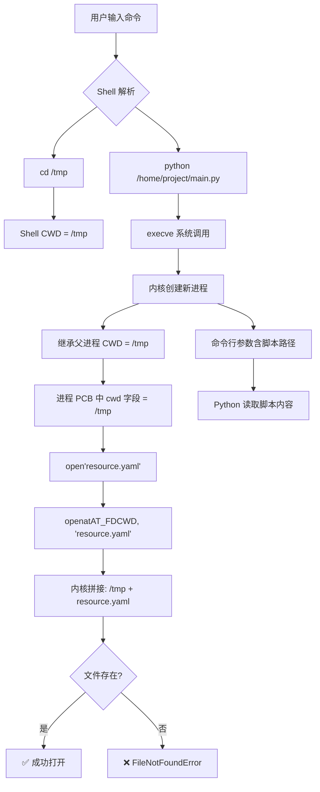

# 🧭 相对路径终极指南

## —— 一场跨越半个世纪的上下文错位与现代解法

> **"我在 `src/utils.py` 里写了 `open('config.json')`，为什么从项目根目录运行成功，从别处运行就报错？"**

这不是你的疏忽，而是**操作系统、编程语言与人类直觉**之间一场持续了50年的"上下文错位"。

本文将带你穿透迷雾，从内核机制到工程哲学，构建一套**可防御、可迁移、可传承**的路径认知体系。无论你是 Python、Go、Rust 还是 Node.js 开发者，这篇指南都将为你点亮前行的路。

---

## 📋 目录导航

- [🌐 一、问题现场：一个报错引发的认知地震](#一问题现场)
- [🔬 二、内核视角：相对路径的唯一裁判](#二内核视角)
- [🧠 三、认知根源：双重路径语义的冲突](#三认知根源)
- [📜 四、历史纵深：Unix 哲学的必然选择](#四历史纵深)
- [🚀 五、现代解法：多语言最佳实践](#五现代解法)
- [⚠️ 六、`__file__` 的致命陷阱](#六file的致命陷阱)
- [🛡️ 七、防御性编程：军规与清单](#七防御性编程)
- [🔮 八、未来趋势：位置透明的编程范式](#八未来趋势)
- [💫 结语与行动指南](#结语)

---


## 🌐 一、问题现场：一个报错引发的认知地震

### 1.1 经典案例再现

```python
# myapp/core/config.py
def load():
    with open("resources/app.yaml") as f:  # ⚠️ 看似无害，实则脆弱
        return yaml.safe_load(f)
```

| 运行方式                                                     | 结果                  | 根本原因                                         |
| ------------------------------------------------------------ | --------------------- | ------------------------------------------------ |
| `cd myapp && python -c "from core.config import load; load()"` | ✅ 成功                | CWD = `myapp/`，能找到 `resources/app.yaml`      |
| `cd /tmp && python /path/to/myapp/core/config.py`            | ❌ `FileNotFoundError` | CWD = `/tmp`，内核查找 `/tmp/resources/app.yaml` |
| `python -m myapp.core.config`                                | ❓ 取决于启动目录      | CWD 由调用者决定，与模块位置无关                 |

### 1.2 直觉 vs 现实：两种参照系的碰撞

```
┌─────────────────────────────────────────────────────────────┐
│  🧑 开发者直觉（模块相对路径）                              │
│  "resources/ 就在 config.py 旁边，程序应该知道去哪找它。"   │
│  参照系原点：当前源文件位置                                 │
│  认知模型：本体论 —— "我是谁，我拥有什么"                   │
└─────────────────────────────────────────────────────────────┘
                            ↓
                            ↓ 冲突！
                            ↓
┌─────────────────────────────────────────────────────────────┐
│  🖥️ 系统现实（工作目录相对路径）                            │
│  "我只认你此刻站在哪里（CWD），不关心你从哪个文件出发。"    │
│  参照系原点：进程当前工作目录                               │
│  认知模型：现象学 —— "此刻我身处何地"                       │
└─────────────────────────────────────────────────────────────┘
```

> 💡 **核心洞见**：这不是路径写错，而是**两种参照系的根本冲突**。操作系统只提供"现象学"视角，而开发者需要"本体论"锚点。

---


## 🔬 二、内核视角：相对路径的唯一裁判

### 2.1 从命令到文件打开：完整生命周期



> 📌 **关键点**：`openat(AT_FDCWD, ...)` 中的 `AT_FDCWD` 表示使用进程的当前工作目录，这是 POSIX 标准的核心设计 [[31]]。

### 2.2 三个颠覆性事实

| 事实                     | 说明                                                     | 验证代码                                                     |
| ------------------------ | -------------------------------------------------------- | ------------------------------------------------------------ |
| **CWD ≠ 脚本目录**       | CWD 由启动上下文决定，与 `__file__` 完全无关             | `print(f"CWD: {os.getcwd()}\nScript: {Path(__file__).parent}")` |
| **CWD 是动态可变的**     | 运行中可被 `os.chdir()` 修改，后续所有相对路径全部受影响 | `os.chdir('/new'); open('test.txt')` → 查找 `/new/test.txt`  |
| **内核不感知"源码位置"** | 系统调用仅依赖 PCB 中的 CWD 字段，脚本路径仅作为参数传递 | `strace python script.py 2>&1 \| grep openat`                |

### 2.3 为什么这样设计？

> 💡 **本质**：操作系统将程序视为**通用数据处理器**，而非"绑定资源的模块"。这是 Unix 哲学"程序协作"的基石：
>
> *"Make each program do one thing well. To do a new job, build afresh rather than complicate old programs."*  
> —— Kernighan & Pike, *The Unix Programming Environment* (1984)

```bash
# Unix 哲学的典范：每个工具处理流式数据，不关心数据来源的物理位置
grep "ERROR" /var/log/syslog | sort | uniq
```

若程序强制绑定到自身目录，则无法实现这种跨目录协作。

---


## 🧠 三、认知根源：双重路径语义的冲突

我们无意识中期望两种路径，但系统只提供一种机制：

| 语义类型                                         | 开发者意图                 | 典型场景                 | 系统支持     | 正确解法                           |
| ------------------------------------------------ | -------------------------- | ------------------------ | ------------ | ---------------------------------- |
| **模块相对路径**<br>(Module-relative)            | "我的资源就在我身边"       | 加载配置、模板、数据文件 | ❌ 需手动锚定 | `importlib.resources` / `embed.FS` |
| **工作相对路径**<br>(Working-directory-relative) | "输出放在我当前操作的地方" | 生成报告、日志、用户文件 | ✅ 原生支持   | 直接使用相对路径                   |

### 3.1 决策树：我该用哪种路径？

```
                    需要访问文件
                          ↓
            ┌─────────────┴─────────────┐
            ↓                          ↓
    文件属于模块/包？用户数据/输出？
            ↓                          ↓
          ✅ 是                       ✅ 是
            ↓                          ↓
    ┌───────┴───────┐          使用 CWD 相对路径
    ↓               ↓          open("output.csv")
  需要打包？仅开发使用？       或允许用户指定
    ↓               ↓
  ✅ 是           ✅ 是         Path(args.out or "out.csv")
    ↓               ↓
importlib.resources   Path(__file__).parent
files(pkg).joinpath()  / "data.json"
```

---


## 📜 四、历史纵深：Unix 哲学的必然选择

### 4.1 安全边界：防止路径遍历攻击

```bash
# 若程序自动访问自身目录，恶意构造脚本路径可能导致安全问题
python ../../../../etc/shadow  # 潜在风险
```

明确分离 CWD 与脚本路径，是**沙箱隔离**的基础。这也是为什么现代容器和沙箱环境严格控制 CWD 的原因之一。

### 4.2 历史惯性

POSIX 标准的路径解析模型已固化50年，改变将破坏整个 Unix 工具链生态。问题被优雅地"上推"至应用层解决——这正是**关注点分离**原则的体现。

---


## 🚀 五、现代解法：多语言最佳实践

### 5.1 演进全景

| 阶段         | 核心思想               | 代表方案                                                     | 优势                   | 局限                              |
| ------------ | ---------------------- | ------------------------------------------------------------ | ---------------------- | --------------------------------- |
| **原始修补** | 手动锚定脚本位置       | `Path(__file__).parent`                                      | 简单直接               | `__file__` 可能不存在；打包后失效 |
| **语言原生** | 资源即模块组成部分     | `importlib.resources` (Py)<br>`embed.FS` (Go)<br>`include_str!` (Rust) | 安全、支持打包、跨平台 | 需语言版本支持                    |
| **构建抽象** | 逻辑路径与物理路径解耦 | Webpack/Vite 资源导入                                        | 开发体验流畅           | 仅限前端生态                      |
| **范式革新** | 规避文件系统依赖       | 12-Factor（环境变量）<br>Docker（固定 WORKDIR）              | 部署一致性高           | 改变开发习惯                      |

### 5.2 ✅ Python 3.9+ 最佳实践

> 📌 **重要更新**：Python 3.11 起，`open_text()`、`read_text()` 等旧函数已被**弃用**，推荐使用 `files()` API。

```python
# ✅ 现代推荐方案：importlib.resources.files()
from importlib.resources import files
import yaml

def load_config():
    """
    安全加载包内资源，支持：
    - 常规安装
    - zip/egg 打包
    - PyInstaller 打包
    - 命名空间包
    """
    # files() 返回 Traversable 对象，支持链式调用
    config_path = files('myapp.data').joinpath('app.yaml')
    
    # 直接读取文本内容（推荐）
    config_text = config_path.read_text(encoding='utf-8')
    return yaml.safe_load(config_text)
    
    # 或作为文件对象打开
    # with config_path.open('r', encoding='utf-8') as f:
    #     return yaml.safe_load(f)
```

```python
# ✅ 需要真实文件路径时使用 as_file()
from importlib.resources import files, as_file

def process_with_external_tool():
    """
    当需要传递真实文件路径给外部工具时使用 as_file()
    例如：subprocess 调用、C 扩展库等
    """
    resource = files('myapp.data').joinpath('model.bin')
    
    with as_file(resource) as path:
        # path 是真实的 pathlib.Path 对象
        # 如果资源在 zip 中，会自动解压到临时文件
        subprocess.run(['external_tool', str(path)])
        # 退出上下文后自动清理临时文件
```

```python
# ✅ Python 3.7-3.8 兼容方案
try:
    from importlib.resources import files
except ImportError:
    # Python 3.7-3.8 使用 backport
    from importlib_resources import files  # pip install importlib_resources
```

> 📌 **最佳实践总结** [[4]]：
> - **永远优先使用 `importlib.resources` 而非 `open()` 访问包内资源**
> - Python 3.9+ 使用标准库 `importlib.resources.files()`
> - Python 3.7-3.8 使用 `importlib_resources` 兼容包
> - 保持资源文件小巧且基于文本（如可能）

### 5.3 ✅ Go 1.16+ 最佳实践

```go
// 编译期嵌入，运行时零依赖
package config

import (
    _ "embed"
    "gopkg.in/yaml.v3"
)

//go:embed config.yaml
var configYAML []byte

//go:embed templates/*.html
var templates embed.FS

func LoadConfig() (*Config, error) {
    var cfg Config
    err := yaml.Unmarshal(configYAML, &cfg)
    return &cfg, err
}

func GetTemplate(name string) ([]byte, error) {
    return templates.ReadFile("templates/" + name)
}
```

### 5.4 ✅ Rust 最佳实践

```rust
// 编译期嵌入，零运行时开销
const CONFIG: &str = include_str!("../config.yaml");

pub fn get_config() -> &'static str {
    CONFIG
}

// 或使用 include_bytes! 处理二进制资源
const MODEL: &[u8] = include_bytes!("../model.bin");
```

### 5.5 ✅ Node.js (ESM) 最佳实践

```javascript
// ESM 模块中获取模块目录
import { fileURLToPath } from 'url';
import { dirname, join } from 'path';

const __filename = fileURLToPath(import.meta.url);
const __dirname = dirname(__filename);

// 构建资源路径
const configPath = join(__dirname, 'config', 'app.json');

// Node.js 20.11+ 可使用 import.meta.resolve()
// const configUrl = import.meta.resolve('./config/app.json');
```

### 5.6 ✅ Docker 部署最佳实践

```dockerfile
FROM python:3.11-slim

# 固定工作目录，确保一致性
WORKDIR /app

# 安装为可编辑包，资源路径正确
COPY . .
RUN pip install -e .

# 明确入口点
ENTRYPOINT ["python", "-m", "myapp.main"]
```

```bash
# 用户通过卷挂载控制 I/O，不依赖 CWD
docker run -v "$(pwd):/io" myapp --input /io/data.csv --output /io/result.csv
```

---


## ⚠️ 六、`__file__` 的致命陷阱

> 🚨 **关键警告**：`__file__` **并非总是存在**！Python 官方文档明确指出 `__file__` 是**可选属性** [[21]][[27]]。

### 6.1 `__file__` 不存在的场景

| 场景                   | 问题                                      | 影响                                          | 解决方案                                                  |
| ---------------------- | ----------------------------------------- | --------------------------------------------- | --------------------------------------------------------- |
| **交互式环境**         | `python -c "..."` 或 REPL 中无 `__file__` | `NameError`                                   | 避免在库代码中使用 `__file__`                             |
| **C 扩展模块**         | 静态编译的模块无 `__file__`               | `AttributeError`                              | 使用 `importlib.resources` [[25]][[27]]                   |
| **内置模块**           | 如 `_tkinter` 在某些构建中为内置模块      | `AttributeError`                              | 检查 `hasattr(module, '__file__')` [[21]]                 |
| **Zip 包/egg**         | 模块从 zip 归档加载                       | `__file__` 指向 zip 内路径，无法直接 `open()` | 使用 `importlib.resources` [[6]]                          |
| **Namespace Package**  | PEP 420 命名空间包                        | `__file__` 可能为 `None`                      | 使用 `importlib.resources`                                |
| **PyOxidizer**         | 二进制打包工具                            | `__file__` 被移除                             | 使用资源 API [[24]]                                       |
| **Nuitka/PyInstaller** | 某些打包模式                              | `__file__` 可能指向临时路径或不存在           | 使用 `importlib.resources` 或 `sys._MEIPASS` [[20]][[28]] |

### 6.2 真实案例：PyInstaller 与 `__file__`

```python
# ❌ 脆弱代码：PyInstaller 打包后可能失败
config_path = Path(__file__).parent / "config.yaml"

# ✅ 健壮代码：兼容所有打包方式
from importlib.resources import files
config_text = files('myapp').joinpath('config.yaml').read_text()
```

> 📌 **PyInstaller 官方立场**："`__file__` is documented as optional by Python: any code requiring `__file__` is bugged" [[21]]。

### 6.3 安全检测模式

```python
# 如果必须使用 __file__，请添加防护
def get_script_dir():
    """安全获取脚本目录"""
    if '__file__' in globals():
        return Path(__file__).parent.resolve()
    else:
        # 降级策略：使用 CWD 或抛出明确错误
        raise RuntimeError(
            "__file__ not available. "
            "Use importlib.resources for package resources."
        )
```

## 🛡️ 七、防御性编程：军规与清单

### 7.1 五条军规

| 军规                           | 反例（脆弱 ❌）                             | 正例（健壮 ✅）                                        |
| ------------------------------ | ------------------------------------------ | ----------------------------------------------------- |
| **1. 包内资源用专用 API**      | `open(Path(__file__).parent / "data.bin")` | `files('pkg.data').joinpath('data.bin').read_bytes()` |
| **2. 永不假设 CWD = 脚本目录** | `open("config.yaml")`                      | 明确使用 `files()` 或 `Path(__file__).parent`         |
| **3. 路径拼接用标准库**        | `"data" + "/" + "file.txt"`                | `Path("data") / "file.txt`                            |
| **4. 输出保留 CWD 语义**       | `Path("/app/output.csv").write(...)`       | `Path(args.out or "output.csv").write(...)`           |
| **5. 打包前验证资源**          | 无验证                                     | `python -c "from mypkg import load; load()"`          |

### 7.2 跨平台注意事项

| 平台            | 注意事项                      | 解决方案                                |
| --------------- | ----------------------------- | --------------------------------------- |
| **Windows**     | 路径分隔符 `\` 需转义         | 使用 `pathlib.Path` 或 `/` [[38]][[39]] |
| **macOS/Linux** | 区分大小写                    | 命名保持小写，测试时验证                |
| **Windows**     | 不区分大小写                  | 在 CI 中用 Linux 测试大小写敏感         |
| **网络路径**    | Windows UNC：`\\server\share` | 使用 `Path(r"\\server\share\file")`     |

### 7.3 故障排查 Checklist

```markdown
## 🔍 路径问题排查清单

### 基础诊断
- [ ] 打印调试信息：
  ```python
  print(f"CWD={os.getcwd()}")
  print(f"__file__={__file__ if '__file__' in dir() else 'N/A'}")
```

- [ ] 检查 `__file__` 是否存在：
  ```python
  python -c "import sys; print(hasattr(sys.modules[__name__], '__file__'))"
  ```

### 打包验证
- [ ] PyInstaller：验证资源是否嵌入
  ```bash
  pyinstaller --add-data "config.yaml:myapp/data" main.py
  ```

- [ ] 测试打包后运行：
  ```bash
  dist/main/main --test
  ```

- [ ] .NET/Java：检查文件是否标记为"复制到输出目录"

### 容器/部署
- [ ] Docker：确认 `WORKDIR` 设置
- [ ] 检查卷挂载路径是否正确
- [ ] 验证文件权限：`ls -l`

### 跨平台
- [ ] Windows：检查路径分隔符
- [ ] Linux：检查大小写敏感
- [ ] 权限问题：避免 `PermissionError`
## 🔮 八、未来趋势：位置透明的编程范式

### 8.1 技术趋势三重奏

| 趋势             | 代表技术                               | 核心价值                                   |
| ---------------- | -------------------------------------- | ------------------------------------------ |
| **资源内嵌化**   | Rust `include!`、Go `embed`、WASM 模块 | 消除运行时 I/O 依赖，提升安全与性能        |
| **虚拟文件系统** | WASI、FUSE、Deno KV                    | 统一抽象层，屏蔽物理存储细节               |
| **声明式路径**   | Vite 资源导入、`pkg://` URI 提案       | 开发者描述"逻辑关系"，工具链处理"物理映射" |

### 8.2 理想中的路径语法（展望）

```python
# 模块资源（编译时/导入时解析）
config = load_resource("pkg://myapp/config.yaml")

# 用户工作区（运行时解析，映射到 CWD 或用户指定目录）
report = save_to("workspace://output.pdf")

# 网络资源（透明获取，带缓存策略）
logo = fetch("cdn://assets/logo.png", cache="immutable")
```

> 🌱 **演进方向**：从"手动管理路径上下文"走向"**声明意图，工具链负责实现**"。

## 💫 结语与行动指南

### 核心要义

相对路径的迷思，从来不只是技术细节。它是：

- **人类直觉与机器逻辑的碰撞**
- **模块化理想与运行时现实的张力**
- **软件工程"关注点分离"原则的生动演绎**

理解这一点，你便能：

> 🔹 看透 `FileNotFoundError` 的本质，不再盲目试错  
> 🔹 设计出**自包含、可移植、可协作**的模块  
> 🔹 在云原生时代从容应对 Docker、K8s、Serverless 的复杂部署  
> 🔹 写出兼容**二进制打包、Zip 分发、交互式环境**的健壮代码

### 📚 延伸阅读

- [Python 官方文档：importlib.resources](https://docs.python.org/3/library/importlib.resources.html) 
- [PEP 451: A ModuleSpec Type for the Import System](https://peps.python.org/pep-0451/)
- [Go Blog: Embedding Files in Go](https://go.dev/blog/embed)
- [12-Factor App: Config & Logs](https://12factor.net/config)
- [PyInstaller 高级主题](https://pyinstaller.org/en/stable/advanced-topics.html) 


